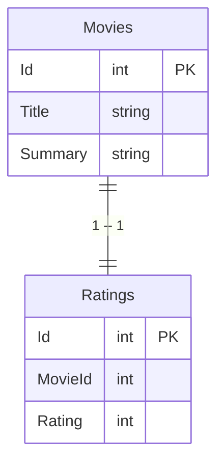

# Movie review system

## Introduction

This is basic movie-review-system, where user can add new movie, rate it and comment. Max rating is 5, min rating is 1. Movies have comments, which are integrated in different system. The written application also allows users to view the average rating of the movie.

## Setup

### Prerequisites

Make you are installed:

```bash
dotnet 3.1 or later
```

### Building the application:

```bash
dotnet build
```

### Running the application:

```bash
dotnet run
```

### Database

The application uses PostgreSQL database. Here is the database schema:

```sql
CREATE TABLE movies IF NOT EXISTS
(
    id SERIAL PRIMARY KEY,
    title VARCHAR(100) NOT NULL,
    summary TEXT NOT NULL,
);

CREATE TABLE ratings IF NOT EXISTS
(
    id SERIAL PRIMARY KEY,
    movie_id INT NOT NULL,
    rating INT NOT NULL,
    FOREIGN KEY (movie_id) REFERENCES movies(id)
);
```

Comments are handled by the external system and fetched from the following endpoint:
- [https://jsonplaceholder.typicode.com/comments]



## API Documentation

### Endpoints

- `GET /movies`: Returns a list of all movies
- `GET /movies?minRating={minRating}&maxRating={maxRating}`: Returns a list of movies with ratings between minRating and maxRating. Accepted values for minRating and maxRating are between 1 and 5 inclusive.
- `GET /movies{id}`: Returns a movie with the specified id
- `POST /movies`: Creates a new movie
- `PUT /movies{id}`: Updates movie with the specified id
- `DELETE /movies{id}`: Deletes movie with the specified id
- `POST /movies{id}/ratings`: Adds a rating to a movie with the specified id. The rating should be between 1 and 5 inclusive.
